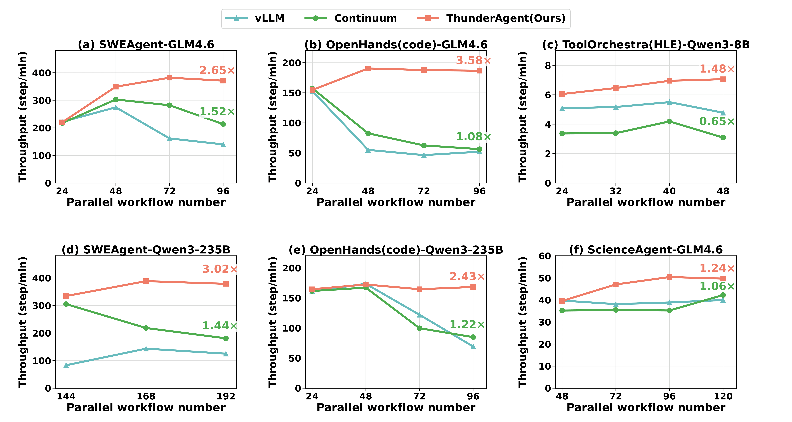

<!-- markdownlint-disable MD001 MD041 -->
<p align="center">
  
</p>

<h3 align="center">
Fast, simple and program-aware agentic inference system.
</h3>

<p align="center">
| <a href="https://github.com/HaoKang-Timmy/ThunderAgent/tree/main/wiki"><b>Wiki</b></a> | <a href="https://docs.vllm.ai"><b>Documentation</b></a> | <a href="https://blog.vllm.ai/"><b>Blog</b></a> | <a href="https://arxiv.org/abs/2309.06180"><b>Paper</b></a> |
</p>


---

## About
ThunderAgent is a fast and easy-to-use library for agentic inference and rollout.


ThunderAgent is fast with:

- Agentic program-aware scheduler that increases KV-cache hit rate and reduces memory imbalance across nodes, increasing agentic inference **throughputs 1.5-3.6x** across multiple agentic workflows.
- Tool-call lifecycle management with automatic resource reclaim for more stable and reliable long-running rollouts

ThunderAgent is flexible and easy to use with:
- OpenAI-compatible API passthrough with only one changing, adding `Program_id` to the sending API.
- Multiple inference support for [vLLM](https://github.com/vllm-project/vllm) and [SGLang](https://github.com/sgl-project/sglang)

- Multiple agentic RL training example like [Search-R1](https://github.com/PeterGriffinJin/Search-R1) agent with [slime](https://github.com/THUDM/slime) and [mini-sweagent](https://github.com/SWE-agent/mini-swe-agent) with [SkyRL](https://github.com/NovaSky-AI/SkyRL).
- Real-time visualization of agentic trajectory metrics including total tokens, tool-use time, and per-program profiling.

### Overview

ThunderAgent sits between agent clients and the infrastructure layer as an agentic workflow scheduler. On one hand, it improves inference throughput of vLLM/SGLang across multiple GPU nodes through program-aware scheduling. On the other hand, it provides a unified tool management interface for resources like Docker containers and remote APIs.

<p align="center">
  
</p>

### Inference & Evaluation Results

ThunderAgent improves vLLM throughput by **1.5–3.6×** across diverse agentic workloads including SWE-Agent, OpenHands, and ToolOrchestra.

<p align="center">
  
</p>

## Getting Started

Install ThunderAgent from source:

```bash
git clone git@github.com:HaoKang-Timmy/ThunderAgent.git
cd ThunderAgent
pip install -e .
```
How to use?
Choose one backend you like, for example vllm.
```bash
uv pip install vllm --torch-backend=auto # install vllm

vllm serve Qwen/Qwen3-32B --port 8000 # serve a model

thunderagent --backend-type vllm --backends http://localhost:8000 --port 9000 --metrics --profile # launch ThunderAgent, make sure to send request through 9000.
```
How to embed with your own agentic workflow?

```python
# original openai sender
openai.client.chat.completions.create(
            model=self.config.model_name,
            messages=messages,
          )
# ThunderAgent openai sender
extra_body = {}
extra_body["program_id"] = "unique_id"
# if you use docker for your agentic workflow
# extra_body["docker_ids"] = ["docker_id1", "docker_id2", ...]
openai.client.chat.completions.create(
            model=self.config.model_name,
            messages=messages,
            extra_body = extra_body
          )
```


## Contributing

We welcome and value any contributions and collaborations.
Please create a pull request.

## Citation

If you use ThunderAgent for your research, please cite our [paper](https://arxiv.org/abs/2309.06180):

```bibtex

```

## Contact Us
If you meet any problem implementing, modifying and if you have any thoughts and suggestions please send email to `hkang342@gatech.edu`,`ergt2025@gmail.com`,`weilixu2@illinois.edu`
### Main Project Contributers
Hao Kang(Georgia Tech)`hkang342@gatech.edu`, Ziyang Li(individual researcher)`ergt2025@gmail.com`, Weili Xu(UIUC)`weilixu2@illinois.edu`

