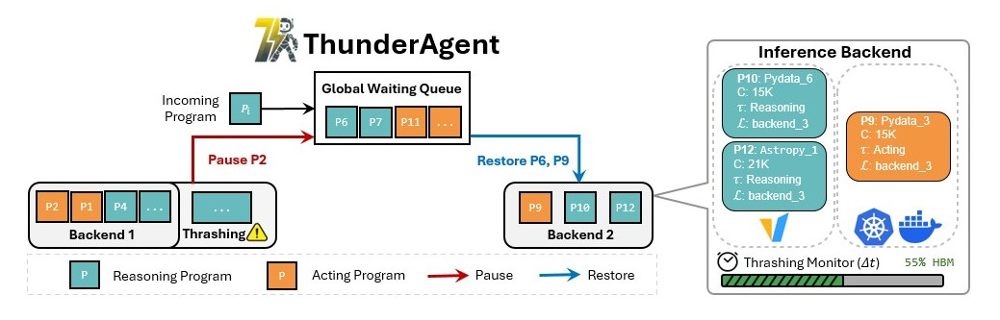
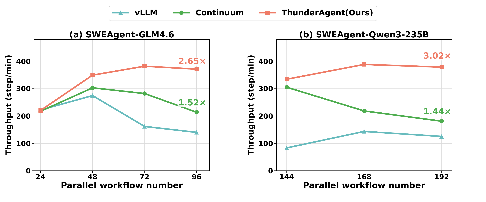

# Overview
This folder contains reproducible end-to-end guides for running SWE-bench evaluations with **ThunderAgent + vLLM** across different agent workflows (e.g., **mini-swe-agent** and **OpenHands (code)**).



## mini-swe-agent + ThunderAgent Use Case

### Prerequisites
- Python 3.10 -- 3.13
- [uv](https://docs.astral.sh/uv/) package manager
- GPU(s) with appropriate CUDA drivers

### Intro
Run the official [mini-swe-agent](https://github.com/SWE-agent/mini-swe-agent) on SWE-Bench through ThunderAgent and vLLM.

### Setup
```bash
# Create and activate env
uv venv --python 3.12
source .venv/bin/activate

# Install vLLM (GPU build), mini-swe-agent in editable mode, and datasets
uv pip install vllm --torch-backend=auto
uv pip install -e examples/inference/mini-swe-agent
uv pip install datasets
```
We also provide a one-click setup script: [`setup.sh`](mini-swe-agent/scripts/setup/setup.sh).


### How to run the experiment


#### Reproduction scripts

Test hardware: 8x H100 (NVIDIA driver 580.95.05 / CUDA 13.0).

- [`reproduce_glm4.6`](mini-swe-agent/scripts/reproduce/reproduce_glm4.6): end-to-end vLLM -> ThunderAgent -> mini-extra swebench for GLM-4.6-FP8.
- [`reproduce_qwen3_235B`](mini-swe-agent/scripts/reproduce/reproduce_qwen3_235B): end-to-end vLLM -> ThunderAgent -> mini-extra swebench for Qwen3-235B-A22B.

- Expected results:



#### One node example
1) Start vLLM to serve the model:
```bash
vllm serve <MODEL_NAME> --tensor-parallel-size <NUM_GPUS> --enable-auto-tool-choice --tool-call-parser <TOOL_PARSER> --port <VLLM_PORT>
```
2) Start ThunderAgent (pointing at your vLLM backend):
```bash
python -m ThunderAgent --backends http://localhost:<VLLM_PORT> --port <TA_PORT>
```
3) Configure [`swebench.yaml`](mini-swe-agent/src/minisweagent/config/benchmarks/swebench.yaml) to call ThunderAgent.


4) Run SWE-Bench via mini-swe-agent through ThunderAgent:
```bash
mini-extra swebench \
  --subset lite \
  --split test \
  --workers 128 \
  --output ./swebench_output 
```

#### Multi nodes example
1) Start vLLM to serve the model:
```bash
vllm serve <MODEL_NAME> --tensor-parallel-size <NUM_GPUS> --enable-auto-tool-choice --tool-call-parser <TOOL_PARSER> --host 0.0.0.0 --port <VLLM_PORT>
```

```bash
vllm serve <MODEL_NAME> --tensor-parallel-size <NUM_GPUS> --enable-auto-tool-choice --tool-call-parser <TOOL_PARSER> --host 0.0.0.0 --port <VLLM_PORT>
```

2) Start ThunderAgent (pointing at your vLLM backend):
```bash
python -m ThunderAgent --backends http://<VLLM_HOST1>:<VLLM_PORT>,http://<VLLM_HOST2>:<VLLM_PORT> --port <TA_PORT>
```
3) Configure [`swebench.yaml`](mini-swe-agent/src/minisweagent/config/benchmarks/swebench.yaml) to call ThunderAgent.

4) Run SWE-Bench via mini-swe-agent through ThunderAgent:
```bash
mini-extra swebench \
  --subset lite \
  --split test \
  --workers 128 \
  --output ./swebench_output 
```


### What we changed (to reuse in your own setup)
- **Program ID injection**  
  Location: [`swebench.py`](mini-swe-agent/src/minisweagent/run/benchmarks/swebench.py#L138) (`process_instance()`).  
  What: Assign a unique `program_id` per SWE-bench instance and pass it via `extra_body.program_id` on every model call.  
  Why: ThunderAgent uses this field to separate requests into per-program state (see [`get_program_id()` in app.py](../../ThunderAgent/app.py#L42)).

- **Program release hook**  
  Location: [`swebench.py`](mini-swe-agent/src/minisweagent/run/benchmarks/swebench.py#L181) (`finally:`).  
  What: Send `POST /programs/release` to ThunderAgent with the same `program_id` after the instance finishes.  
  Why: Frees router-side bookkeeping (tokens / pause-resume state) so finished programs do not linger.


## Repository Layout
```text
inference/
|-- readme.md
|-- mini-swe-agent/
|   |-- LICENSE.md
|   |-- README.md
|   |-- pyproject.toml
|   |-- scripts/
|   |   |-- reproduce/
|   |   `-- setup/
|   `-- src/
|       `-- minisweagent/
`-- docs/
    |-- mini-swe-agent/
    |   `-- figures/
    `-- thunder/
        `-- figures/
```
